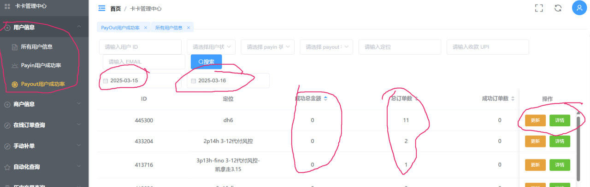

## 手机代付故障排查，切记拿走手机或者放回原位置都需要修改定位以方便追踪。

### 1.根据过去5天查询成功率低的手机
#### 卡卡报表查询过去2-3天的代付成功率的手机，按次成功笔数从小到大排序。留意成功率是0，并且失败次数多的手机。查看详情，确认手机代付故障并修改定位，标记人工审核，手动转出201来确认手机问题。然后放3天让其恢复正常再使用。

卡卡报表查询过去3天的代付限额的手机，按次数从大到小排序

点击详情后能看到每天的限额情况，如果限额次数过多，把用户标记一下代收异常，然后人工查询确认原因。

[返回首页](/README.md)