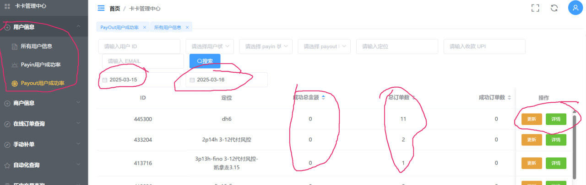
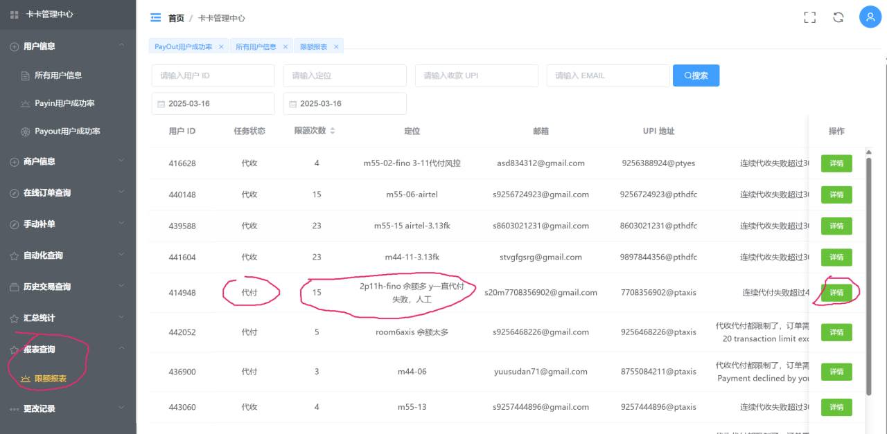
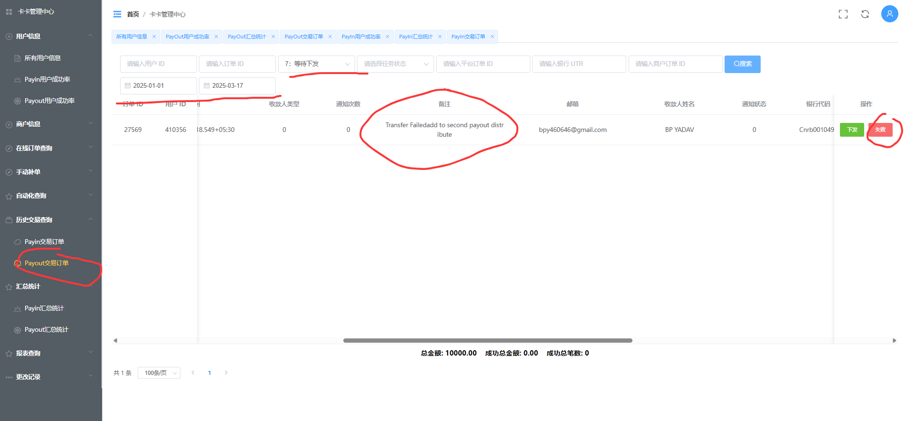
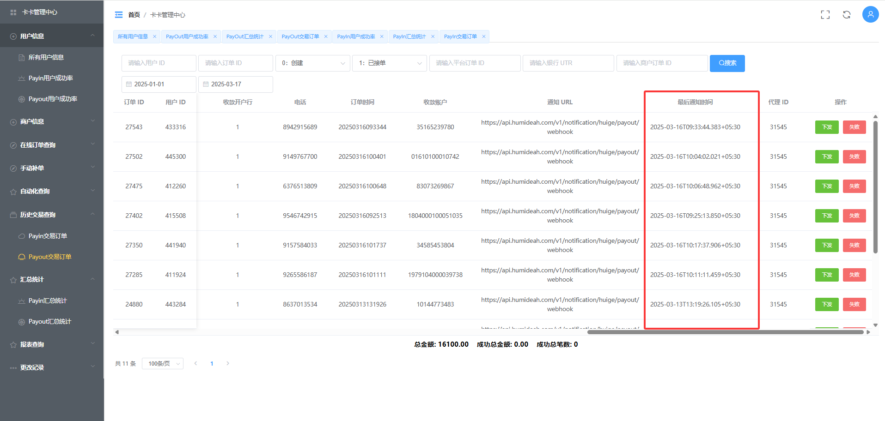

## 手机代付故障排查，切记拿走手机或者放回原位置都需要修改定位以方便追踪。

### 1.根据过去5天查询成功率低的手机
#### 卡卡报表查询过去2-3天的代付成功率的手机，按次成功笔数从小到大排序。留意成功率是0，并且失败次数多的手机。查看详情，确认手机代付故障并修改定位，标记人工审核，手动转出201来确认手机问题。然后放3天让其恢复正常再使用。

### 2.卡卡报表查询过去3天的代付限额的手机，按次数从大到小排序

#### 点击详情后能看到每天的限额情况，如果限额次数过多，把用户标记一下代收异常，然后人工查询确认原因。

### 3.查询异常代付的订单，并手动下发（如果备注是“IFSC”或者“银行账号错误”，直接手动失败,否则超过两次手动失败【如果是upi风险不算做一次】）
!

### 4.如何查看代付长时间没有支付
先看PayoutManualDistribution.png中的创建时间，再看PayoutHistoryLastTime.png的时间，如果两个时间相差过大，就是长时间没有支付

### 5.先处理比较早的订单

### 6.查看代付订单的错误信息，并且根据错误信息进行不同的处理

#### （1）upi风险控制，账户会自动被系统“禁止代付”，24小时之后自动开启

[返回首页](/README.md)
