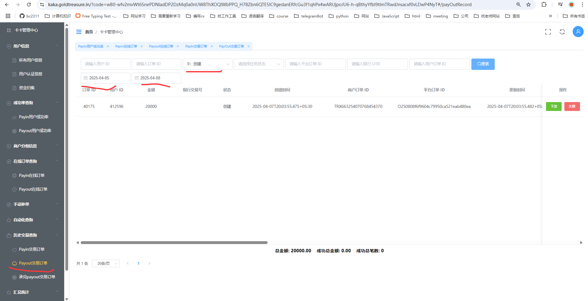
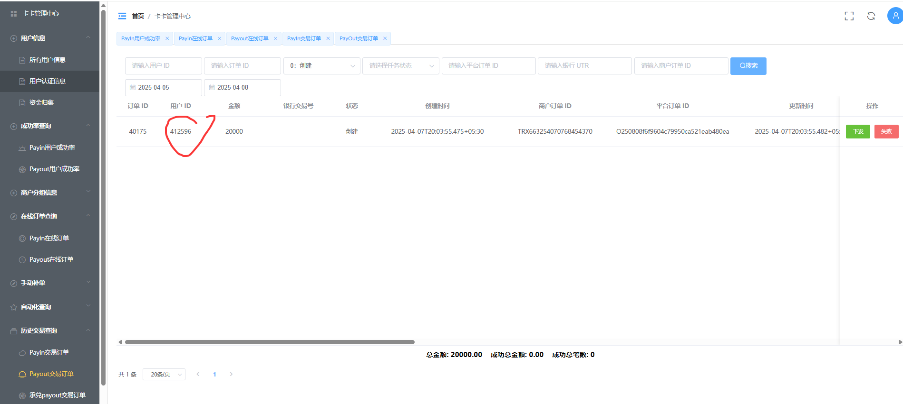
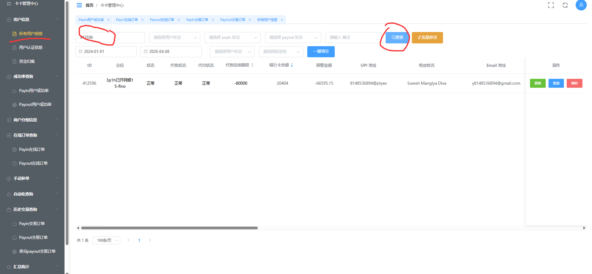
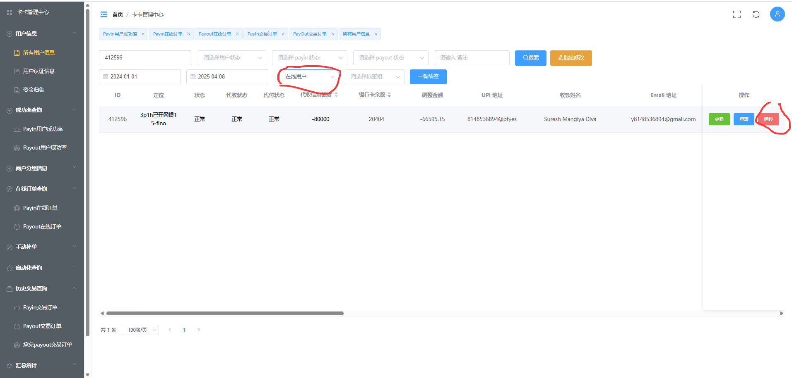

### 1.如何查询正在支付的代付订单
#### 

### 2.根据手机的userid来检查这笔订单在谁身上

#### （1）复制代付订单的userid

#### （2）到用户信息，输入userid，然后点击搜索。

#### （3）查询账户是否在线，如果在线，使用响铃功能查找手机，如果不在线并且找不到手机可以直接失败这一笔订单（！！失败前记得先停止手机App！！）
#####  （邦哥那边回调的会慢一点，如果着急可以手动失败邦哥平台的订单，但是需要核对好订单）
#####  （如果手动失败订单，记得清理手机app数据，然后再重新运行app）

